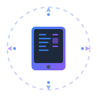

# LocalFirstApp

**Local-first（本地优先）** 是一种回归用户本位的软件设计理念。它不仅仅关乎技术，更关乎数字世界的自由与尊严。我们相信：

- **数据主权**：数据属于你，而非云端服务商。它应首先保存在你的设备上，你可以随时导出、迁移或自行托管。
- **离线可用**：网络应当是增强体验的加速器，而非使用的前提。无论身处何地，软件核心功能都应触手可及。
- **无缝同步**：在多台设备间可靠地同步数据，通过冲突检测与合并技术，确保你的创作在任何设备上都保持一致。
- **隐私至上**：默认的安全与隐私保护，最大程度减少对中心化服务的依赖。

本站致力于成为 Local-first 软件的精选目录与实践指南，帮助你发现那些真正尊重用户的工具。

## 收录标准

我们正在寻找符合以下特质的应用：

*   **⚡️ 离线优先**：断网状态下依然可以使用核心功能，优雅降级。
*   **💾 本地存储**：数据默认存储在本地设备或用户自托管的后端。
*   **🔓 自由迁移**：支持开放格式，提供完整的数据导出能力，拒绝被锁定。
*   **🛡️ 透明隐私**：清晰的隐私策略，最小化数据收集，且过程可审计。

**加分项：**
*   **开源**：代码公开，社区可审查与贡献。
*   **端到端同步**：支持 E2EE 或其他可验证的安全同步方案。

### 如何贡献

我们需要你的帮助来完善这个目录！

*   **推荐应用**：请阅读 **[收录指南](./submission_guide.md)**，并按规范提交你发现的优质应用。
*   **改进文档**：纠正错误、补充分类标签或完善描述。
*   **分享见解**：欢迎提交翻译、使用案例分析或技术对比文章。

## 目录导航

我们正在构建以下领域的精选列表：

*   **🧠 生产力**：[知识管理](./notes) / [办公协作](./collaboration) / [开发工具](./development)
*   **🎨 创意生活**：[图形图像](./graphics) / [影音媒体](./media) / [财务管理](./finance)
*   **🛠️ 实用工具**：[安全隐私](./security) / [文件传输](./transfer) / [系统工具](./system)
*   **🤖 未来科技**：[智能家居](./smarthome) / [人工智能](./ai)

## 社群项目

我们不仅是观察者，更是创造者。

除了收录现有应用，Local First 社群正在汇聚志同道合的开发者与设计师，**共同打造我们心目中理想的本地优先软件**。我们将通过实际项目，探索数据主权、离线优先与跨端同步的最佳实践路径，构建真正属于用户的数字工具。

## 加入讨论

- ✈️ [Telegram](https://t.me/localfirstapp)
- 💬 [GitHub Discussions](https://github.com/orgs/localfirstapp/discussions)
- 🟢 [微信群](https://github.com/orgs/localfirstapp/discussions/1)

## 路线图

我们正在持续改进本站体验：

- [ ] **分类检索**：引入多维度的分类标签、搜索与过滤功能。
- [ ] **自动化提交**：建设应用提交表单与基础自动化校验流程。
- [ ] **技术指南**：整理参考架构与实现清单（CRDT/OT、P2P、同步协议等）。
- [ ] **深度专题**：发布案例研究与数据主权最佳实践报告。

## 本地开发与预览

本站基于 `mdBook` 构建，你可以轻松在本地运行：

1.  **安装工具**：`cargo install mdbook`
2.  **启动预览**：`mdbook serve -o`
3.  **构建站点**：`mdbook build`

---

> **致谢**：感谢所有推动 Local-first 运动的社区与项目。让我们一起努力，夺回属于我们的数字生活。
